# Universidad de San Carlos de Guatemala
**Facultad de Ingeniería**  
**Escuela de Ciencias y Sistemas**  
### Curso: *Análisis y Diseño de Sistemas 1*  
### Proyecto 2 - Fase 1
---
**Grupo 7**  
**Integrantes:**
| Nombre                                 | Carnet     |
|-----------------------------------------|------------|
| Kevin Golwer Enrique Ruiz Barbales      | 201603009  |
| Luis Carlos de León Torón               | 202212535  |
| Diego Fernando Debroy Salazar           | 202101923  |
| Luciano Isaac Xiquin Ajpop              | 201800632  |

**Catedrático:** Ing. José Manuel Ruíz Juárez  
**Auxiliar:** José Manuel Ibarra Pirir  
**Fecha de entrega:** 20 de Junio 2025  

---

## 📑 Índice

1. [Requerimientos Funcionales y No Funcionales](#1-requerimientos-funcionales-y-no-funcionales)
  - [Requerimientos Funcionales](#requerimientos-funcionales)
  - [Requerimientos No Funcionales](#requerimientos-no-funcionales)
2. [Diagrama de Casos de Uso](#2-diagrama-de-casos-de-uso)
3. [Historias de Usuario](#3-historias-de-usuario)
4. [Diagrama de Clases](#4-diagrama-de-clases)
5. [Diagrama de Componentes](#5-diagrama-de-componentes)
6. [Diagrama de Despliegue](#6-diagrama-de-despliegue)
7. [Diagrama Entidad-Relación](#7-diagrama-entidad-relación)
8. [Mockups / Prototipos de Interfaces](#8-mockups--prototipos-de-interfaces)
9. [Documentación de Pruebas](#9-documentación-de-pruebas)
10. [Documentación de Pruebas E2E](#10-documentación-de-pruebas-e2e)
  - [Herramienta](#herramienta)
  - [Cobertura](#cobertura)
  - [Automatización](#automatización)
  - [Resultados Esperados](#resultados-esperados)
11. [Herramienta de Gestión Kanban](#10-herramienta-de-gestión-kanban)
  - [Link a la Herramienta](#link-a-la-herramienta)
  - [Capturas del Tablero Kanban](#capturas-del-tablero-kanban)
12. [Grabaciones del Sprint](#11-grabaciones-del-sprint)
  - [Link a las Grabaciones](#link-a-las-grabaciones)
13. [Evaluación del Scrum Master](#12-evaluación-del-scrum-master)

---

## 1. Requerimientos Funcionales y No Funcionales

### ✅ Requerimientos Funcionales

#### Registro y Autenticación
* Usuarios pueden registrarse e iniciar sesión sin aprobación previa.
* Empresas deben registrarse y esperar aprobación del administrador antes de iniciar sesión.
* Administrador inicia sesión con credenciales predeterminadas y debe hacer doble autenticación subiendo un archivo auth.ayd1.

#### Funcionalidades del Administrador

* Ver y dar de baja empresas aceptadas.
* Ver y dar de baja usuarios registrados.
* Empresas con más publicaciones.
* Categorías más buscadas

#### Funcionalidades del Usuario

* Buscar empleo por área
* Aplicar a empleos con carga de CV en PDF.
* Ver detalle de la oferta: incluye tipo de contrato, jornada, modalidad, requerimientos, etc.
* Visualizar listado de aplicaciones realizadas con estado del proceso.
* Eliminar una postulación, con mensaje de confirmación.

#### Funcionalidades de Empresas
* Visualizar postulaciones recibidas (ordenadas por fecha).
* Ver CVs y cambiar estado de aplicación a: CV visto, Finalista, Proceso Finalizado.
* Publicar ofertas de empleo (formulario con múltiples campos).
* Enviar correo a finalistas con instrucciones de próximos pasos.
* Ver historial de ofertas publicadas (finalizadas, en proceso, canceladas).


### ⚙️ Requerimientos No Funcionales

#### Técnicos
* La contraseña debe ser almacenada encriptada en la base de datos.
* Usar una base de datos relacional (Oracle)
* El sistema debe de estar disponible 24h
* De preferencia que el desarrollo sea hecho en react js
* Debe de ser agil al momento de moverse entre vistas

#### Calidad de Software
* Pruebas unitarias
* Pruebas E2E automatizadas en la parte de usuario


---

## 2. Diagrama de Casos de Uso

  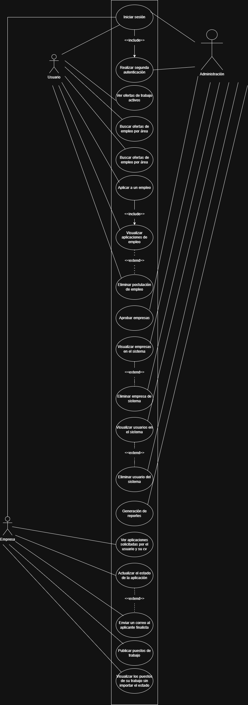
---

## 3. Historias de Usuario
  
### Administrador

#### 1. Aprobación de empresas
**Como** que soy un administrador autenticado  
**Cuando** accedo a la lista de empresas pendientes  
**Entonces** puedo ver su información y aprobar o rechazar cada solicitud.

#### 2. Visualización y baja de empresas
**Como** que soy un administrador autenticado  
**Cuando** visualizo la lista de empresas aceptadas  
**Entonces** puedo dar de baja a cualquier empresa que lo requiera.

#### 3. Visualización y baja de usuarios
**Como** que soy un administrador autenticado  
**Cuando** accedo a la lista de usuarios registrados  
**Entonces** puedo dar de baja a cualquier usuario por motivos válidos.

#### 4. Generación de reportes
**Como** que soy un administrador autenticado  
**Cuando** ingreso al módulo de reportes  
**Entonces** puedo generar estadísticas sobre vacantes, áreas más buscadas, etc.

---

### Empresa

#### 5. Registro de empresa
**Como** que soy una empresa nueva  
**Cuando** ingreso mis datos en el formulario de registro  
**Entonces** mi solicitud quedará pendiente hasta ser aprobada por el administrador.

#### 6. Autenticación con aprobación
**Como** que soy una empresa registrada pero no aprobada  
**Cuando** intento iniciar sesión  
**Entonces** se me informa que debo esperar aprobación antes de acceder.

#### 7. Publicar vacante
**Como** que soy una empresa aprobada y autenticada  
**Cuando** ingreso al formulario de publicación de empleo  
**Entonces** puedo crear un nuevo puesto completando toda la información requerida.

#### 8. Ver aplicaciones
**Como** que soy una empresa autenticada  
**Cuando** accedo a la sección de aplicaciones  
**Entonces** puedo ver la lista de postulantes ordenada por fecha.

#### 9. Atender aplicación
**Como** que he recibido aplicaciones a una vacante  
**Cuando** visualizo el CV de un postulante  
**Entonces** puedo cambiar su estado a “CV visto”, “Finalista” o “No apto”.

#### 10. Notificar a finalistas
**Como** que he marcado a un postulante como finalista  
**Cuando** confirmo su selección  
**Entonces** el sistema le envía automáticamente un correo con los pasos a seguir.

#### 11. Ver historial de vacantes
**Como** que soy una empresa autenticada  
**Cuando** ingreso a mi historial de publicaciones  
**Entonces** puedo ver los procesos activos, finalizados y cancelados.

---

### Usuario

#### 12. Registro de usuario
**Como** que soy una persona interesada en buscar empleo  
**Cuando** completo el formulario de registro  
**Entonces** puedo iniciar sesión y acceder a las vacantes.

#### 13. Autenticación sin aprobación
**Como** que soy un usuario registrado  
**Cuando** ingreso mis credenciales correctamente  
**Entonces** accedo al sistema sin necesidad de aprobación previa.

#### 14. Ver ofertas laborales
**Como** que soy un usuario autenticado  
**Cuando** accedo a la página principal  
**Entonces** puedo ver todas las vacantes disponibles con sus datos clave.

#### 15. Buscar empleo por área
**Como** que soy un usuario autenticado  
**Cuando** selecciono un área en el filtro de búsqueda  
**Entonces** se me muestran únicamente las vacantes relacionadas con esa área.

#### 16. Aplicar a un empleo
**Como** que soy un usuario interesado en una vacante  
**Cuando** ingreso al detalle del puesto y cargo mi CV  
**Entonces** mi postulación se registra y se envía a la empresa correspondiente.

#### 17. Ver mis postulaciones
**Como** que soy un usuario autenticado  
**Cuando** accedo a mi historial de aplicaciones  
**Entonces** puedo ver el estado y detalles de cada postulación.

#### 18. Eliminar postulación
**Como** que ya apliqué a un empleo  
**Cuando** decido eliminar mi candidatura  
**Entonces** se me pide confirmación y, si acepto, la postulación se elimina del listado.

---

### Autenticación Especial

#### 19. Autenticación de administrador con doble paso
**Como** que soy un administrador  
**Cuando** inicio sesión con credenciales válidas y subo el archivo `auth.ayd1`  
**Entonces** el sistema valida el archivo y me da acceso al panel principal.

---

## 4. Diagrama de Clases

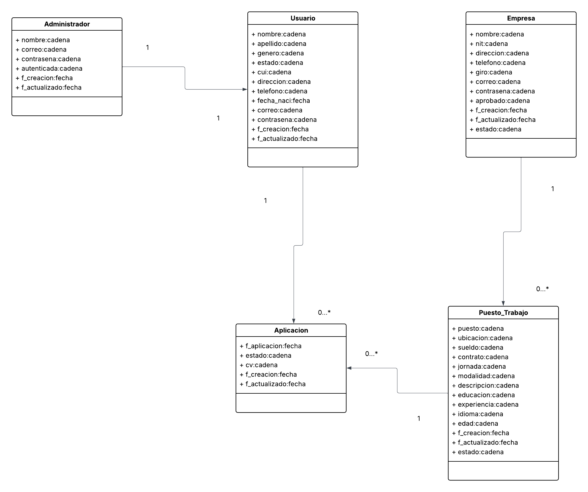

---

## 5. Diagrama de Componentes
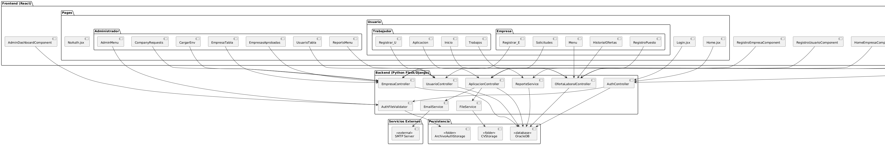

---

## 6. Diagrama de Despliegue

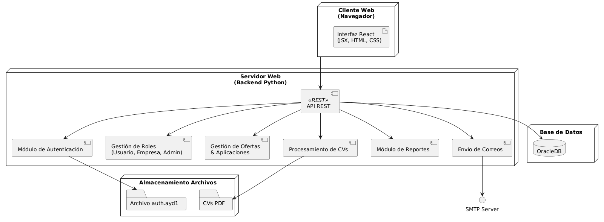
---

## 7. Diagrama Entidad-Relación

  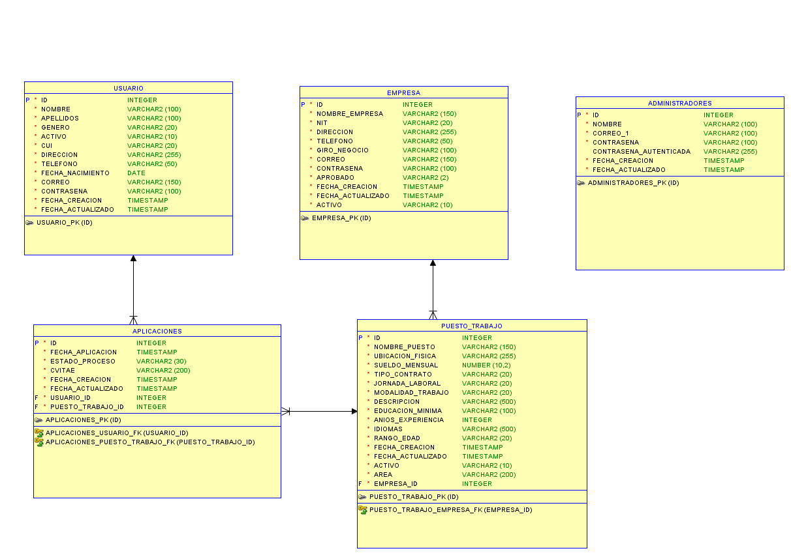
---

## 8. Mockups / Prototipos de Interfaces

  

---

## 9. Documentación de Pruebas

### Pruebas Unitarias

Las pruebas unitarias son muy importantes ya que se toman unidades individuales del código y se prueban de forma aislada para comprobar su correcto funcionamiento, asegurando que producen los resultados esperados. Estas pruebas no dependen de la interfaz de usuario, únicamente del código.

### Herramienta Utilizadas

* Pytest

### Activación del Entorno Virtual

> [!TIP]
> .\venv\Scripts\activate

### Comando para Ejecutar las Pruebas Unitarias

> [!TIP]
> pytest tests/

### Instrucciones Claras sobre Cómo Ejecutar las Pruebas

* **Herramienta Utilizada:** Pytest
* **Código de Error:** 403 (como ejemplo en el caso de prueba fallida)
* **Captura de Pantalla:** [Insertar captura de pantalla aquí]
* **Descripción del Error:** El error 403 indica que el usuario no tiene permisos para aprobar una empresa, ya que solo los administradores pueden realizar esta acción.
* **Qué Debería Hacer el Código:**  El código debería permitir la aprobación de una empresa solo si el usuario autenticado es un administrador, devolviendo un estado 200 con un mensaje de éxito; de lo contrario, debería devolver un 403 con un mensaje de error.

### Código de error
```
# ¡¡ ERROR !!
def test_aprobar_empresa_no_autorizado(client, mocker):
    # Simula que el usuario es de tipo empresa, no admin
    mock_user = mocker.Mock()
    mock_user.tipo = 'empresa'
    mock_user.is_authenticated = True
    mocker.patch('flask_login.current_user', new=mock_user)

    response = client.put("/api/company/approve", json={"id": 99})

    assert response.status_code == 403
    data = response.get_json()
    assert data["status"] == "error"
    assert "Solo los administradores pueden aprobar" in data["message"]

```

### Captura de las pruebas unitarias:
  

### Explicación del código erróneo:

Esta prueba no es correcta y nos ayuda a validar que la implementación del endpoint relacionado a la aceptación de empresas puede darse únicamente desde el lado del administrador. No puede ser de tipo usuario o empresa porque dará error.

### ¿Qué debería hacer el código?

1. **test_crear_usuario**
* Simula el registro de un nuevo usuario.
* Verifica que el API /api/users responda correctamente con algún estado esperado (201, 400, 409 o 500).
* Asegura que se devuelvan campos "status" y "message" en la respuesta.

2. **test_ingresar_empresa**
* Simula el registro de una nueva empresa.
* Verifica que el API /api/users responda correctamente con algún estado esperado (201, 400, 409 o 500).
* Asegura que se devuelvan campos "status" y "message" en la respuesta.

3. **test_login_usuario_exitoso**
* Simula el inicio de sesión de un usuario.
* Usa mocker para evitar la conexión real a Oracle y simula la autenticación.
* Verifica que se retorne un login exitoso (código 200) y tipo "usuario".

4. **test_logout**
* Verifica que el endpoint /logout funcione y cierre sesión correctamente.
* Espera una respuesta con success = True y un mensaje adecuado.

5. **test_aprobar_empresa_exitoso**
* Simula que un admin autenticado aprueba una empresa (vía /api/company/approve).
* Mockea la base de datos y el usuario admin.
* Asegura que se retorne un estado 200 y un mensaje de éxito.

6. **test_aprobar_empresa_no_autorizado**
* Simula un intento de aprobación por parte de un usuario no administrador.
* Está comentado porque da error en algunos entornos si current_user no está correctamente mockeado.

## 10. Documentación de Pruebas E2E

### Herramienta utilizada
Selenium


### Cobertura
Pruebas realizadas:

  - Login
  - Autenticación del administrador
  - Ver tablero de empresas pendientes de ser aprobadas
  - Actualizar tablero
  - Volver al menú principal del Administrador
  - Cerrar Sesión

### Automatización

Se creó un archivo .bat de nombre e2e_start el cual tiene de contenido el comando comoo tal para ejecutar un archivo de python

python selenium
---

### Resultados Esperados
Primero incia en el menú principal


Luego se va al login y se escribe automaticamente las credenciales
NOTA: Esto realizará una autenticación a un usuario de tipo ADMIN

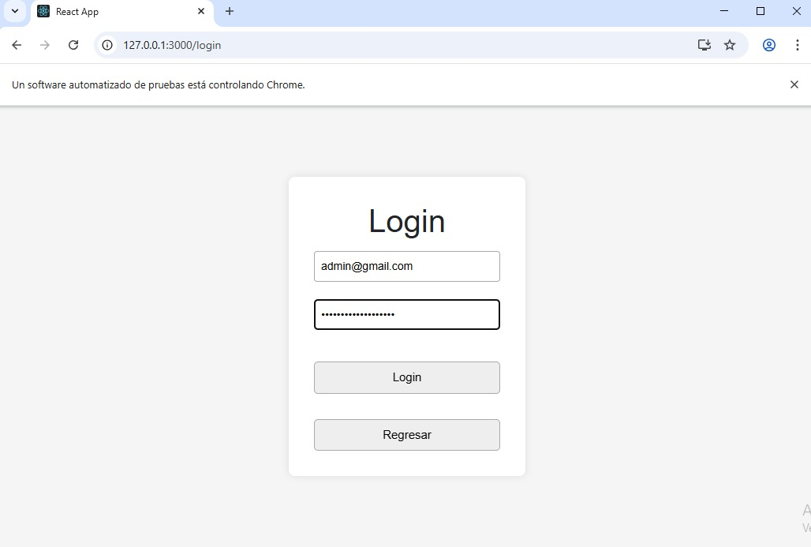

Se realiza la segunda autenticación con un archivo de una ruta definifa.

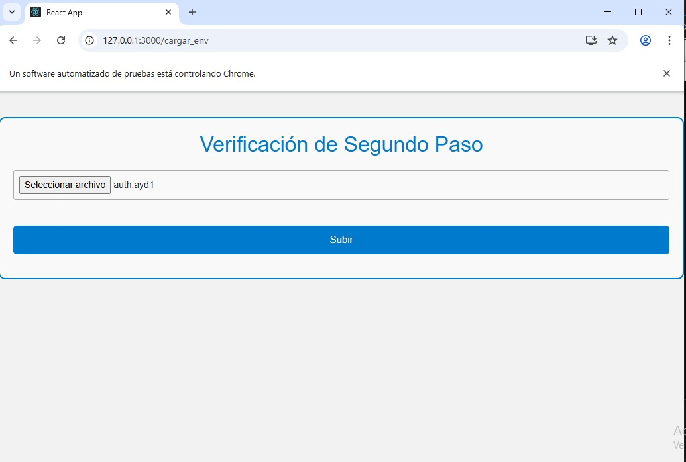

Posterior a eso se activa la alerta que será atendida automáticamente.


Luego se dirije al respectivo menú de administrador.


Revisa las tablas de empresas pendientes.


Por ultimo regresa al menú del admin, cierra sesión y se termina las pruebas satisfactoriamente.


Resultados en consola del proceso realizado.


## 10. Herramienta de Gestión Kanban

### 🔗 Link a la Herramienta

- [Tablero: Sprint 1](https://ingenieria-team-s9kv3ztx.atlassian.net/jira/software/projects/GRUP/boards/3)
- [Tablero: Sprint 2](https://ingenieria-usac-ayd1.atlassian.net/jira/software/projects/KAN/boards/1)

### 🖼️ Capturas del Tablero Kanban

#### Primer Sprint

**Inicio del Sprint**

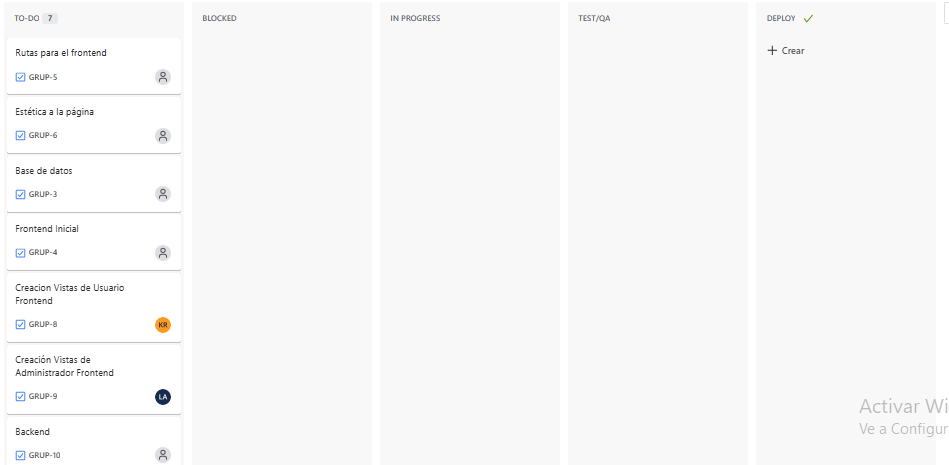

**Durante el Sprint**

- Primer cambio  
  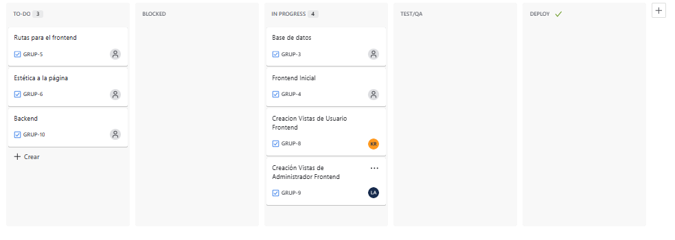

- Segundo cambio  
  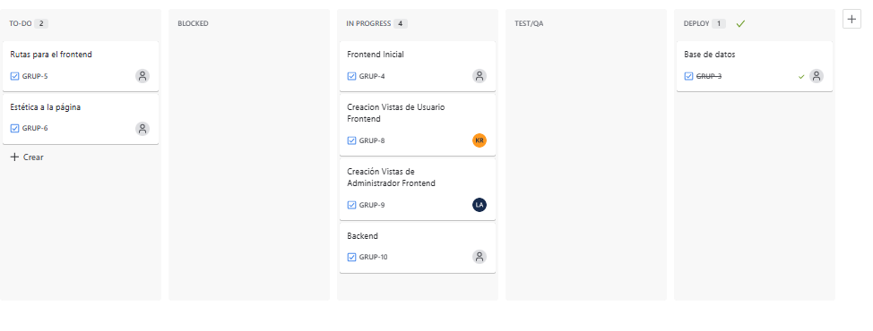

**Final del Sprint**  
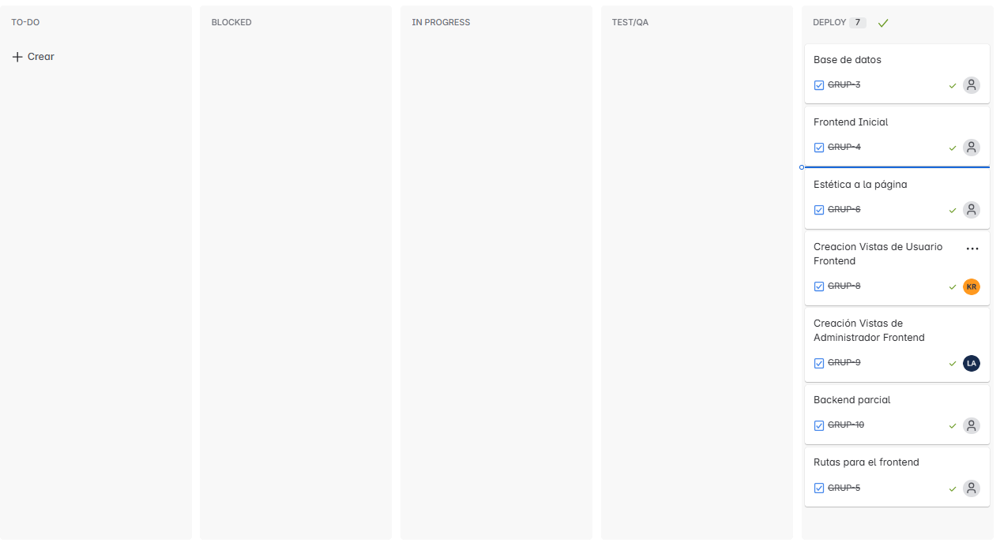

---

#### Segundo Sprint

**Inicio del Sprint**


**Durante el Sprint**

- Primer cambio  
  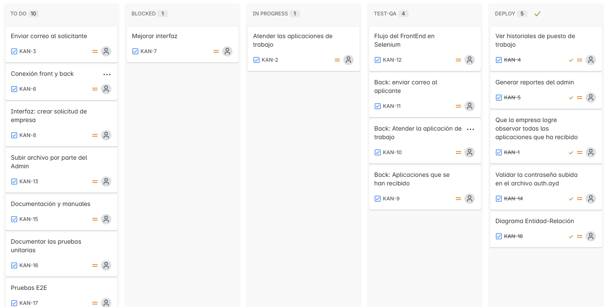

- Segundo cambio
  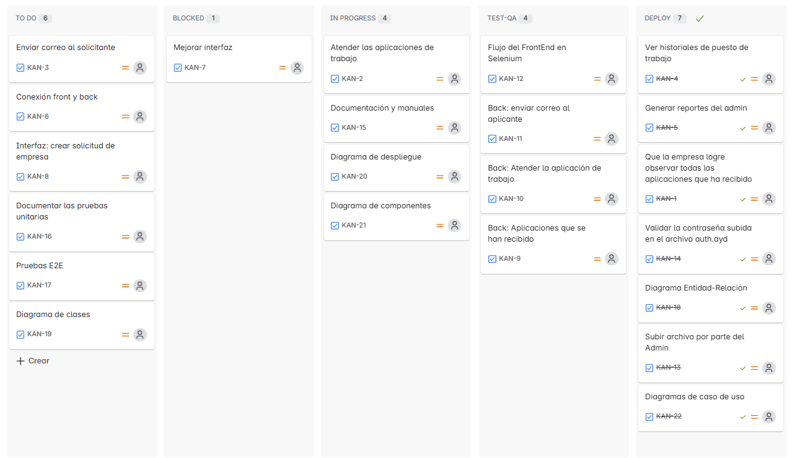

- Tercer cambio
  
  

- Ultimo cambio
  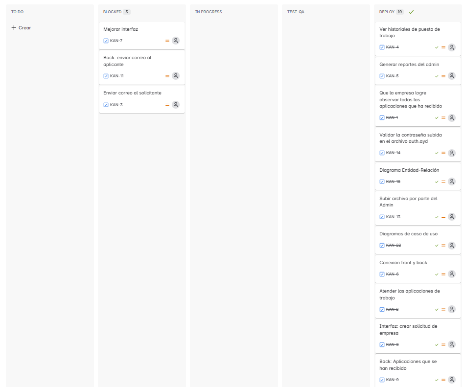
  

---

## 11. Grabaciones del Sprint

### 🎥 Link a las Grabaciones

#### Primer Sprint

- **Sprint Planning:** [Ver video](https://drive.google.com/file/d/1iw_lx4CRwcD7VVpX4jTFLQ027NvzlZjF/view?usp=sharing)
- **Daily Scrum 1:** [Ver carpeta](https://drive.google.com/drive/folders/1ScGcijFIEMwJayz2zw020pM_U8PHPnBI?usp=sharing)
- **Daily Scrum 2:** [Ver carpeta](https://drive.google.com/drive/folders/1VYfJICWsz8s8-vRJ8onlhxsrrOYNfacM?usp=sharing)
- **Sprint Retrospective:** [Ver video](https://drive.google.com/file/d/1j1nTjLu98cxuFrZnLs6pt8VtkEwuNs-Y/view?usp=sharing)

#### Segundo Sprint

- **Sprint Planning:** [Ver video](https://drive.google.com/file/d/1b-znbWgDlIvUB_w60axhEuRa6tYUv5P8/view?usp=sharing)
- **Daily Scrum 1:** [Ver video](https://drive.google.com/file/d/1TjKVQgSbttHVqXidzoywgz5cqCnczFRr/view?usp=sharing)
- **Daily Scrum 2:** [Ver video](https://drive.google.com/file/d/1QnOw_q1Dc3MRVBOYTSvY1Aa--FDKXWoy/view?usp=sharing)
- **Sprint Retrospective:** [Ver carpeta](https://drive.google.com/drive/folders/1gBykP_rG2k4ndOkbPe3kfye34dzyGaNu)

---

## 12. Evaluación del Scrum Master
**1 (muy deficiente)** a **100 (excelente)**.

| Criterio                              | Calificación (1 - 100) |
|---------------------------------------|-------------------------|
| Cumplimiento de objetivos del sprint  |            75             |
| Trabajo establecido en el menor tiempo|            50            |
| Comunicación                          |            80             |
| Trabajo en equipo                     |            75             |
| Código entendible                     |            90             |
| Organización                          |            100             |
| Reuniones                             |            100             |                                                              
---
